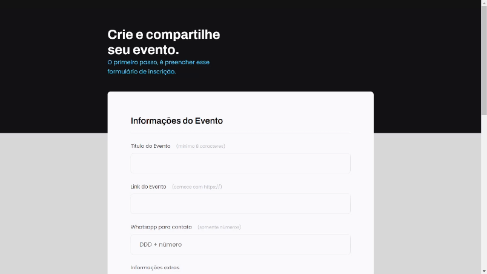

<h1 align="center"> Event Form </h1>

Explorer - Programa exclusivo, promovido pela Rocketseat para ensino de tecnologias WEB.  

  <a href="#-tecnologias">Tecnologias</a>&nbsp;&nbsp;&nbsp;|&nbsp;&nbsp;&nbsp;
  <a href="#-projeto">Projeto</a>&nbsp;&nbsp;&nbsp;|&nbsp;&nbsp;&nbsp;
  <a href="#-layout">Layout</a>&nbsp;&nbsp;&nbsp;

 

  

## 🚀 Tecnologias

Esse projeto foi desenvolvido com as seguintes tecnologias:

- HTML e CSS
- Figma
- Git e Github

## 💻 Projeto

A página faz parte de um exercício para introduzir às tecnologias da web. 
Consiste em um formulário, onde foi trabalhado alguns conceitos de HTML e CSS em conjunto com o Figma.

- [Acesse o Explorer](https://app.rocketseat.com.br/journey/explorer)

## 🔖 Layout

Você pode visualizar o layout do projeto através [DESSE LINK](https://www.figma.com/file/sBda3gs6uk4x8hVFApRDzy/Explorer-Stage-03-Projeto-01-(Copy)?type=design&node-id=1%3A28&mode=dev). É necessário ter conta no [Figma](https://figma.com) para acessá-lo.